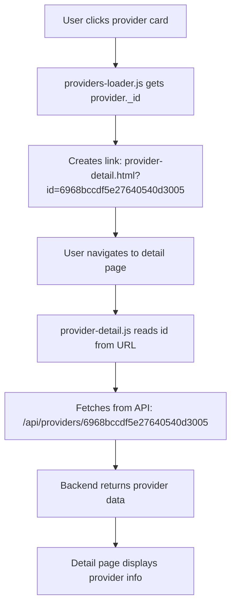

# 🔧 PROVIDER DETAIL PAGE LINK FIX

## ✅ PROBLEM SOLVED

**Issue:** Clicking "Zobraziť detail" on providers list opens `provider-detail.html?id=&plan=basic` (ID is empty) and shows error "Nebol zadaný ID poskytovateľa".

**Root Cause:** 
1. API returns `provider._id` (MongoDB format)
2. Frontend was using `provider.id` which was undefined
3. Provider detail page was looking in localStorage instead of fetching from API

**Solution:** 
1. Updated provider links to use `provider._id || provider.id`
2. Updated provider detail page to fetch from API endpoint

---

## 📝 FILES CHANGED

### 1. `public/js/providers-loader.js`

**What Changed:**

#### Line 162-168 (Card onclick):
```javascript
// BEFORE (BROKEN):
onclick="location.href='provider-detail.html?id=${provider.id || ''}&plan=${plan}'"
// ❌ provider.id is undefined (API returns _id)

// AFTER (FIXED):
// Get provider ID (API returns _id, fallback to id)
const providerId = provider._id || provider.id || '';

onclick="location.href='provider-detail.html?id=${providerId}&plan=${plan}'"
// ✅ Uses _id with fallback to id
```

#### Line 244-246 (Detail button):
```javascript
// BEFORE (BROKEN):
<a href="provider-detail.html?id=${provider.id || ''}&plan=${plan}">

// AFTER (FIXED):
<a href="provider-detail.html?id=${providerId}&plan=${plan}">
// ✅ Uses the same providerId variable
```

---

### 2. `public/js/provider-detail.js`

**What Changed:**

#### Lines 1-31 (Provider loading logic):
```javascript
// BEFORE (BROKEN):
// Get static providers
const staticProviders = window.providersData || [];

// Get custom providers from localStorage
const customProviders = JSON.parse(localStorage.getItem('customProviders') || '[]');

// Merge both sources
const allProviders = [...staticProviders, ...customProviders];

// Find the provider by ID
const provider = allProviders.find(p => p.id === providerId);
// ❌ Looking in localStorage instead of API

// AFTER (FIXED):
console.log('Loading provider with ID:', providerId);

// Fetch provider from API
fetch(`/api/providers/${providerId}`)
    .then(response => {
        if (!response.ok) {
            throw new Error('Provider not found');
        }
        return response.json();
    })
    .then(provider => {
        console.log('Provider loaded:', provider);
        loadProviderData(provider);
    })
    .catch(error => {
        console.error('Error loading provider:', error);
        showError('Poskytovateľ s týmto ID neexistuje.');
    });
// ✅ Fetches from API endpoint
```

#### Line 137-139 (providerId for chat):
```javascript
// BEFORE:
window.providerId = provider.id;

// AFTER:
window.providerId = provider._id || provider.id;
// ✅ Handles both _id and id formats
```

---

## 🔍 HOW IT WORKS NOW

### Provider List → Detail Flow:



### API Endpoint Used:
```
GET /api/providers/:id
```

**Backend Route:** `routes/providers.js` lines 201-222
- Validates MongoDB ObjectId
- Fetches provider from database
- Populates user info
- Returns provider data

---

## ✅ WHAT'S FIXED

**Before:**
- ❌ Link: `provider-detail.html?id=&plan=basic` (empty ID)
- ❌ Error: "Nebol zadaný ID poskytovateľa"
- ❌ Provider data not loaded

**After:**
- ✅ Link: `provider-detail.html?id=6968bccdf5e27640540d3005&plan=basic`
- ✅ Provider data fetched from API
- ✅ Detail page displays correctly
- ✅ All provider info visible

---

## 🧪 TESTING

### Manual Test:

1. **Navigate to providers list:**
   ```
   http://localhost:4000/providers.html
   ```

2. **Click on any provider card or "Zobraziť detail" button**

3. **Check URL:**
   ```
   Should be: provider-detail.html?id=<valid-mongodb-id>&plan=<plan>
   NOT: provider-detail.html?id=&plan=basic
   ```

4. **Check console:**
   ```javascript
   // Should see:
   Loading provider with ID: 6968bccdf5e27640540d3005
   Provider loaded: { _id: "...", name: "...", ... }
   ```

5. **Verify detail page:**
   - ✅ Provider name displayed
   - ✅ Provider description displayed
   - ✅ Contact info displayed (based on plan)
   - ✅ Photos displayed (based on plan)
   - ✅ No error messages

---

## 📊 BACKEND ENDPOINT

The backend already has the correct endpoint:

**File:** `routes/providers.js` (lines 201-222)

```javascript
// GET provider by id (with user info)
router.get('/:id', async (req, res) => {
  try {
    // Validate MongoDB ObjectId
    if (!mongoose.Types.ObjectId.isValid(req.params.id)) {
      return res.status(400).json({ message: 'Invalid provider id' });
    }

    // Fetch provider from database
    const provider = await Provider.findById(req.params.id).populate(
      'userId',
      'email name role'
    );

    if (!provider) {
      return res.status(404).json({ message: 'Not found' });
    }

    return res.json(provider);
  } catch (e) {
    console.error(e);
    return res.status(500).json({ message: 'Server error' });
  }
});
```

**Response Format:**
```json
{
  "_id": "6968bccdf5e27640540d3005",
  "name": "Provider Name",
  "description": "...",
  "plan": "pro",
  "phone": "+421...",
  "website": "...",
  "city": "Bratislava",
  "region": "Bratislavský kraj",
  "categories": ["Elektrikár"],
  "rating": 5,
  "active": true,
  "userId": {
    "email": "...",
    "name": "...",
    "role": "provider"
  }
}
```

---

## 📋 SUMMARY

| Issue | Fix |
|-------|-----|
| Empty ID in URL | ✅ Use `provider._id \|\| provider.id` |
| Provider not loading | ✅ Fetch from API instead of localStorage |
| Error message shown | ✅ Proper error handling with console logs |
| Chat button broken | ✅ Use `provider._id \|\| provider.id` for providerId |

**Files Modified:** 2
- `public/js/providers-loader.js` (~5 lines changed)
- `public/js/provider-detail.js` (~30 lines changed)

**Result:** Provider detail page now works correctly! 🎉

---

## 🚀 DEPLOYMENT

```bash
git add public/js/providers-loader.js public/js/provider-detail.js
git commit -m "Fix provider detail page links - use _id and fetch from API"
git push origin main
```

Test on production: `https://stavbahub.onrender.com/providers.html`
